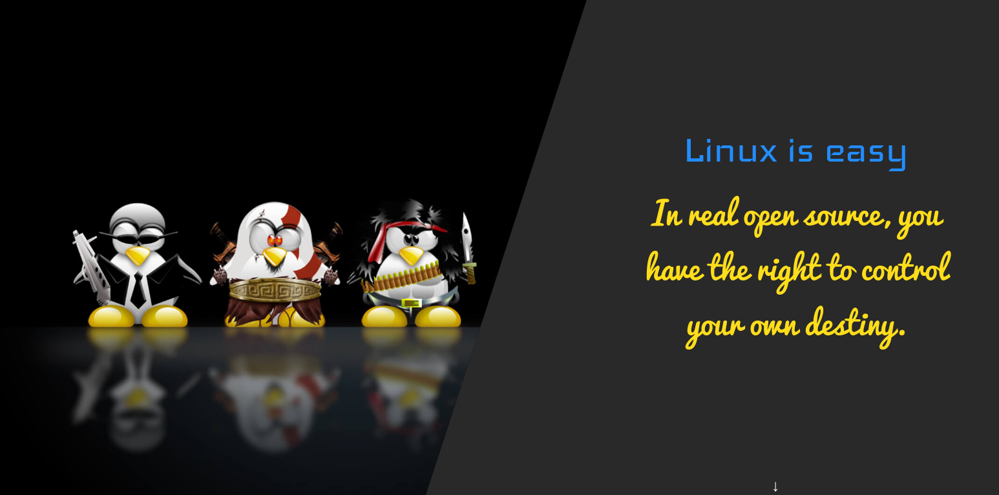

<h1 align="center">
  <br>
  <a href="http://rezaduty.blog.ir/"></a>

</h1>

<p align="center">
	<a href="https://github.com/ellerbrock/open-source-badge/">
		
	</a>
	<a href="https://en.wikipedia.org/wiki/GNU_General_Public_License">
		
	</a>
	<a href="https://github.com/ellerbrock/open-source-badge/">
		
	</a>
	<a href="https://github.com/ellerbrock/open-source-badge/">
		
	</a>
	<a href="https://saythanks.io/to/rezaduty">
		
	</a>
</p>


# What is Linuxiseasy

## is website for online training 

See a live demo [here](https://linuxiseasy.github.io).

in Telegram  [here](https://telegram.me/linuxiseasy).

in Instagram  [here](https://www.instagram.com/linuxiseasy/).

## is linux group for contact with other people

## is remaster linux for any field people(developer,...)

# Download Linux custom iso

See review this version(called Linuxsh) [here](https://linuxiseasy.github.io/linuxsh-review).

for download please goto `releases`


# Website Theme and System

this website built with jekyll

very special thanks :arrow_right: Victor Igor :arrow_left:
A simple and elegant Jekyll theme based on Spacemacs. The theme works well on mobile devices as well.




# Website base subject :rocket:

- [x] What is Linux
- [x] All type linux
- [x] How to give linux certificate
- [x] How to learn work with linux
- [x] How to create usb drive or dvd bootable
- [x] How to install a linux distro
- [x] Linux Structure Part 1
- [x] Linux Structure Part 2
- [x] Linux Command Part 1
- [x] Linux Command Part 2
- [x] how to create build-your-own-linux-distro
- [x] Linuxsh Review

## review :rocket:

- [x] linuxsh review 

- [x] How to create build-your-own-linux-distro

## Project :rocket:

- [x] Command Line Search

- [x] Link Planet Search

- [x] Linux Map 

## for complete linux group please goto :pray:

```md
public_assets/data/linuxmap.geojson
```

# :sparkles: Installation jekyll
	✓ (https://www.digitalocean.com/community/tutorials/how-to-set-up-a-jekyll-development-site-on-ubuntu-16-04) 
# :sparkles: Site/User Settings

customize your site in ``_config.yml``

```ruby

# Site settings
description: A blog about linuxsh remaster linux and learning linux
baseurl: "" # the subpath
url: "" # the base hostname &/|| protocol for your site 

# User settings
username: Lorem Ipsum
user_description: Lorem Developer
user_title: Lorem Ipsum
email: lorem@ipsum.com
twitter_username: loremipsum
github_username:  loremipsum
gplus_username:  loremipsum
disqus_username: loremipsum

```

## :sparkles: How to create a post ? 

_posts create a file .md with structure:

```md
---
layout: post
title: "Lorem ipsum speak.."
date: 2016-09-13 01:00:00
image: '/assets/img/post-image.png'
description: 'about tech'
tags:
- lorem
- tech 
categories:
- Lorem ipsum
twitter_text: 'How to speak with Lorem'
---
```

## Contribute :+1:
:octocat:  You are Contribute this repository <br>
:octocat:  Just ``clone`` or ``fork`` or ``pull request`` repository

## License

The GPL License (GPL)

Copyright (c) 2017 rezaduty <reza.duty.persian@gmail.com>
http://linuxiseasy.github.io/

The GNU General Public License is a free, copyleft license for software and other kinds of works.

The licenses for most software and other practical works are designed to take away your freedom to share and change the works. By contrast, the GNU General Public License is intended to guarantee your freedom to share and change all versions of a program--to make sure it remains free software for all its users. We, the Free Software Foundation, use the GNU General Public License for most of our software; it applies also to any other work released this way by its authors. You can apply it to your programs, too.


<h1 align="center">
  <br>
  <a href="http://rezaduty.blog.ir/"></a>

</h1>